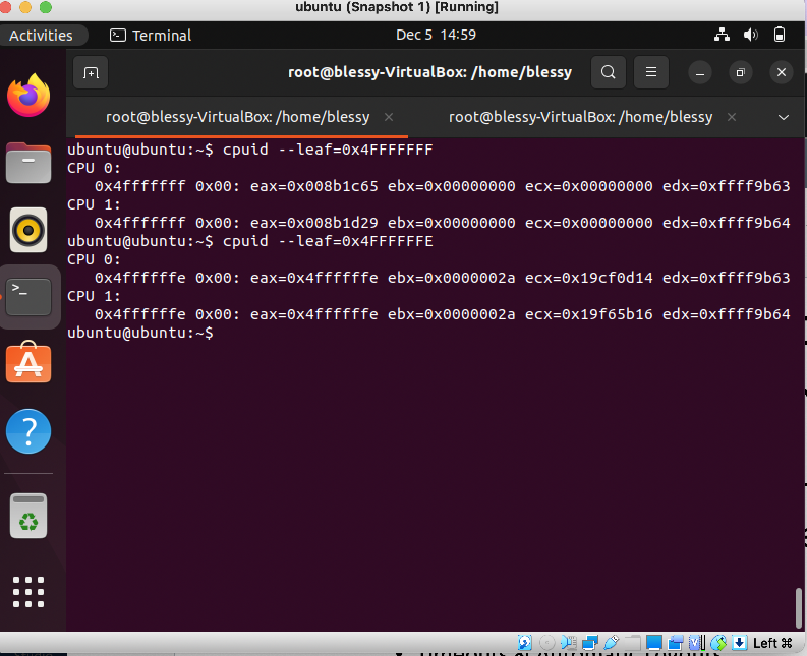
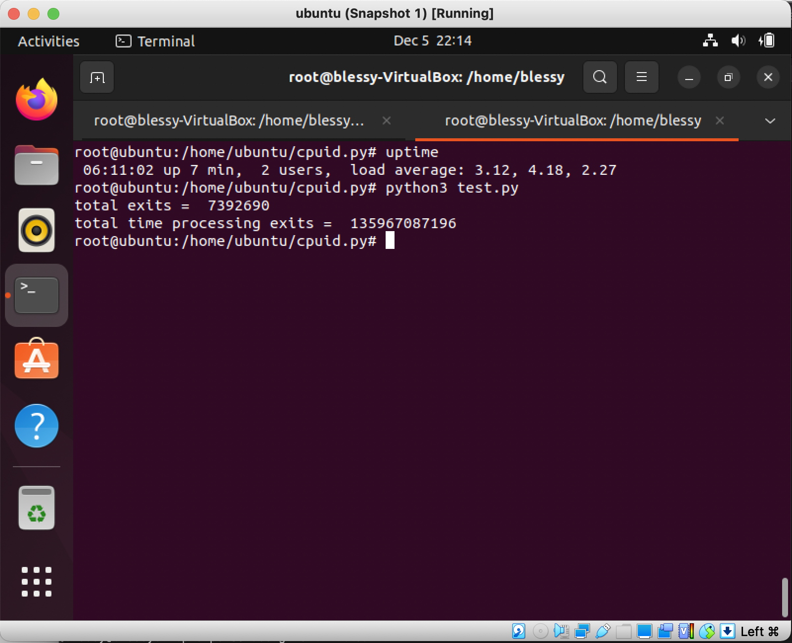

# Assignment 2

## Prerequisites 

Create either a VM on GCP or on VirtualBox (Linux or Debian preferred). The following demonstrates the usage of VirtualBox:

Click on `New` and choose  name=`ubuntu` type=`linux` version=`ubuntu 64-bit` and click `continue`

Select suitable amount of memory say 6000MB and click `continue`

Select `Create a new virtual hard disk now` and click `create`

Select hard disk type to `VDI` and click `continue`

Make the hard disk space to be `dynamically allocated`

Provide a minimum of 50G of storage for the hard disk and click create. 

Double click on the `ubuntu` virtual machine and go through the set up process.

Login with credentials on the GUI and open up a terminal.

**very important** please run the following command:

```shell
VBoxManage modifyvm ubuntu --nested-hw-virt on 
```

This ensures that inner VMs can be spawed using nested virtualization.

Run the following commands:

```shell

sudo su
apt-get update
apt-get upgrade
apt-get install build-essential git
```

Clone the repository

```shell
git clone <repo>
cd cmpe283-assignment-2
```

Set up the required packages that are required for Kernel development using:

```shell
apt-get apt-get install fakeroot ncurses-dev xz-utils libssl-dev bc flex libelf-dev bison
```

Build the kernel, install and reboot the system for changes to take effect. 

```shell
make -j
make -j modules
make install
make modules_install

reboot
```

Now that we have a working set up of the installed kernel, we can test it out using kvm for which we need 
utilities from KVM to be installed. It can be done using:

```shell
apt install qemu qemu-kvm libvirt-daemon libvirt-clients bridge-utils virt-manager cloud-image-utils libguestfs-tools
mkdir ~/images
cd ~/images
wget ""
```

```shell
cat >user-data.txt <<EOF
#cloud-config
password: secretpassword
chpasswd: { expire: False }
ssh_pwauth: True
EOF
```

Create a virtual disk and start up an inner VM using the same
```shell
qemu-img create -b  -F qcow2 -f qcow2 ubuntu-vm-disk.qcow2 5G
virt-install --name ubuntu-vm \
  --virt-type kvm --memory 2048 --vcpus 2 \
  --boot hd,menu=on \
  --disk path=ubuntu-vm-disk.qcow2,device=disk \
  --disk path=user-data.img,format=raw \
  --graphics none \
  --os-type Linux --os-variant ubuntu22.04
```

Login to the new vm
```shell
virsh connect qemu:///ubuntu-vm
```

login using the credentials ubuntu:secretpassword
Install `cpuid`

```shell
sudo su
apt-get update
apt-get install cpuid
```

Test the output of the new leaf nodes using:

```shell
cpuid --leaf=0x4FFFFFFF
cpuid --leaf=0x4FFFFFFE
```

A sample output is as follows


Running a sample python program to emit the total calls and cpu cycles shows and output like:

