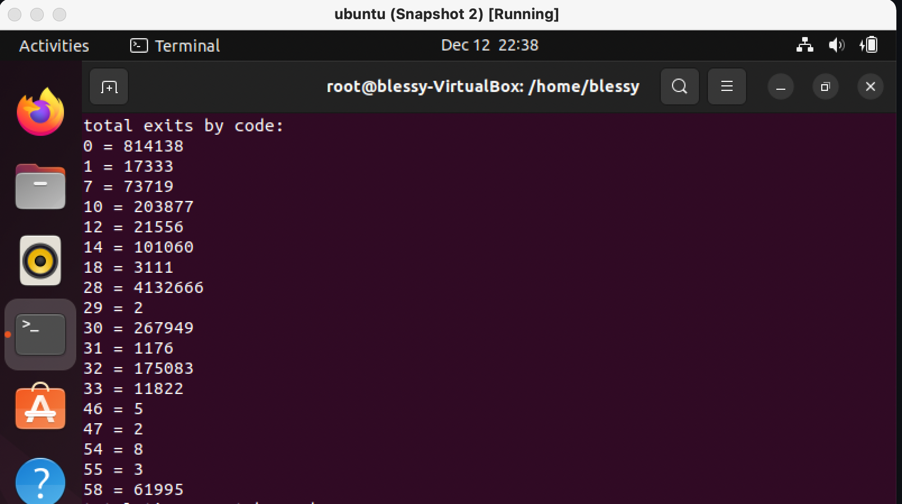

# Assignment 3

## Prerequisites 

Create either a VM on GCP or on VirtualBox (Linux or Debian preferred). The following demonstrates the usage of VirtualBox:

Click on `New` and choose  name=`ubuntu` type=`linux` version=`ubuntu 64-bit` and click `continue`

Select suitable amount of memory say 6000MB and click `continue`

Select `Create a new virtual hard disk now` and click `create`

Select hard disk type to `VDI` and click `continue`

Make the hard disk space to be `dynamically allocated`

Provide a minimum of 50G of storage for the hard disk and click create. 

Double click on the `ubuntu` virtual machine and go through the set up process.

Login with credentials on the GUI and open up a terminal.

**very important** please run the following command:

```shell
VBoxManage modifyvm ubuntu --nested-hw-virt on 
```

This ensures that inner VMs can be spawed using nested virtualization.

Run the following commands:

```shell

sudo su
apt-get update
apt-get upgrade
apt-get install build-essential git
```

Clone the repository

```shell
git clone https://github.com/dblessy/cmpe283-assignment-2
cd cmpe283-assignment-2/linux
```

Set up the required packages that are required for Kernel development using:

```shell
apt-get install fakeroot ncurses-dev xz-utils libssl-dev bc flex libelf-dev bison
```

Copy the .config file and set `CONFIG_SYSTEM_TRUSTED_KEYS=""` and `CONFIG_SYSTEM_REVOCATION_KEYS=""`
```shell
cp -v /boot/config-$(uname -r) .config
```

Build the kernel, install and reboot the system for changes to take effect. 

```shell
make -j
make -j modules
make install
make modules_install

reboot
```

Now that we have a working set up of the installed kernel, we can test it out using kvm for which we need 
utilities from KVM to be installed. It can be done using:

```shell
apt install qemu qemu-kvm libvirt-daemon libvirt-clients bridge-utils virt-manager cloud-image-utils libguestfs-tools
mkdir ~/images
cd ~/images
wget "http://cloud-images.ubuntu.com/releases/22.04/release/ubuntu-22.04-server-cloudimg-amd64.img"
```

```shell
cat >user-data.txt <<EOF
#cloud-config
password: secretpassword
chpasswd: { expire: False }
ssh_pwauth: True
EOF
```

Create a virtual disk and start up an inner VM using the same
```shell
cloud-localds user-data.img user-data.txt
qemu-img create -b ubuntu-22.04-server-cloudimg-amd64.img -F qcow2 -f qcow2 ubuntu-vm-disk.qcow2 4G
virt-install --name ubuntu-vm \
  --virt-type kvm --memory 2048 --vcpus 2 \
  --boot hd,menu=on \
  --disk path=ubuntu-vm-disk.qcow2,device=disk \
  --disk path=user-data.img,format=raw \
  --graphics none \
  --os-type Linux --os-variant ubuntu22.04
```

Login to the new vm
```shell
virsh --connect qemu:///system console ubuntu-vm
```

login using the credentials ubuntu:secretpassword
Install `cpuid`

```shell
sudo su
apt-get update
apt-get install cpuid
```

Test the output of the new leaf nodes using:

```shell
cpuid -l 0x4FFFFFFE -s 10
cpuid -l 0x4FFFFFFE -s 32
```

Yet another sample python program was used to emit the total calls and cpu cycles per exit code. For a code that the SDM doesn't prescribe `not defined` was printed out.




### Questions
Following is the analysis that had been performed for the questions for assignment3

#### Frequency of exits


The above graph was plotted by running a loop on the sample program every 5 seconds to determine the total exits performed and the delta between every 5 seconds was used to plot the graph. As seen the exit count is relatively flat except for the spikes which should be an underlying vm operation that may have been performed at the time.

#### More exits performed during certain VM operations
Exceptions and non-mappable interrupts were seen as the one that was generating the most exits. Common VM operations that generate more exits are CPUID, programs that perform register accesses, RDMSR etc. 

#### How many exits does a full reboot entail
It was observed that `24003813` were performed after a full reboot was performed. The number was observed after running the test program approximately 1 minute after the reboot.

#### Which are the most and least frequent exits
Following are the non-zero exits that were seen:

```shell
0 = 814138
1 = 17333
7 = 73719
10 = 203877
12 = 21556
14 = 101060
18 = 3111
28 = 4132666
29 = 2
30 = 267949
31 = 1176
32 = 175083
33 = 11822
46 = 5
47 = 2
54 = 8
55 = 3
58 = 61995
```
Rest were all `0`. The most common exits as seen were CPUID(10), Control-register accesses(28), Exception or non-maskable interrupt(NMI) (0), WRMSR(32).
